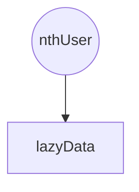

#

I've been learning how different reactivity libraries work as part of the development of
[Reactively](https://github.com/modderme123/reactively).

Fine-grained reactivity libraries have been growing in popularity recently.
Examples include new libraries like
[preact/signals](https://github.com/preactjs/signals),
[usignal](https://github.com/webreflection/usignal),
and now [reactively](https://github.com/modderme123/reactively),
as well as longer-standing libraries like [Solid](https://www.solidjs.com/docs/latest),
[S.js](https://github.com/adamhaile/S), and [CellX](https://github.com/Riim/cellx).
Using these libraries, programmers can make individual variables and functions _reactive_.
_Reactive_ functions run automatically, and re-run 'in reaction' to changes in their sources.

With a library like [Reactively](https://github.com/modderme123/reactively),
you can easily add lazy variables, caching, and incremental recalculation to your typescript/javascript programs.
Reactively is tiny (<1 kb) and has a simple API.
Hopefully, Reactively makes it easy for you to explore the benefits of reactive programming.

Here's an example of using [Reactively](https://github.com/modderme123/reactively) for a lazy variable:

```ts
import { reactive } from "@reactively/core";

const nthUser = reactive(10);

// fetch call is deferred until needed
const lazyData = reactive(() =>
  fetch(`https://data.mysite.io/users?n=${nthUser.value}`)
);

if (needUsers) {
  useBuffer(await lazyData.value);
}
```

Reactive libraries work by maintaining a graph of dependencies between reactive elements.
Modern libraries find these dependencies automatically,
so there's little work for the programmer beyond simply labeling reactive elements.
The library's job is to efficiently figure out which reactive functions to run in responses
to changes elsewhere in the graph.
In this exmaple, our dependency graph is quite simple:

<div align='center'>



</div >

Reactivity libraries are at the heart of modern web component frameworks like Solid, Qwik, Vue, and Svelte.
And in some cases you can add fine-grained reactive state management to other libraries like Lit and React.
[Reactively](https://github.com/modderme123/reactively) comes with a
[decorator](https://github.com/modderme123/reactively/tree/main/packages/decorate) for adding reactive properties
to any class,
as well as prototype
integration with [Lit](https://github.com/lit/lit).
[Preact/signals](https://github.com/preactjs/signals) comes with a prototype integration
with [React](https://reactjs.org/).
Expect more integrations as these reactivity cores mature.
