#

Reactivity is the future of JS frameworks! Reactivity allows you to write lazy variables that are efficiently cached and updated. If you're looking for a new way to write faster JavaScript, look no further.

But how does reactivity work and how is it so efficient?

I've been working on a new fine grained reactivity libary called
[Reactively](https://github.com/modderme123/reactively) inspired by my work on the [SolidJS team](https://www.solidjs.com/contributors). Reactively is currently the fastest reactive library in its category (take benchmarks with a grain of salt). The ideas from Reactively will help SolidJS become even faster.

Below, I want to explore the algorithms and ideas that make fine grained reactivity libraries interesting and fast.

# Introducing Reactively

Fine-grained reactivity libraries have been growing in popularity recently.
Examples include new libraries like
[preact/signals](https://github.com/preactjs/signals),
[usignal](https://github.com/webreflection/usignal),
and now [reactively](https://github.com/modderme123/reactively),
as well as longer-standing libraries like [Solid](https://www.solidjs.com/docs/latest),
[S.js](https://github.com/adamhaile/S), and [CellX](https://github.com/Riim/cellx).
Using these libraries, programmers can make individual variables and functions _reactive_.
_Reactive_ functions run automatically, and re-run 'in reaction' to changes in their sources.

With a library like [Reactively](https://github.com/modderme123/reactively),
you can easily add lazy variables, caching, and incremental recalculation to your typescript/javascript programs.
Reactively is tiny (<1 kb) and has a simple API.
Hopefully, Reactively makes it easy for you to explore the benefits of reactive programming.

Here's an example of using [Reactively](https://github.com/modderme123/reactively) for a lazy variable:

```ts
import { reactive } from "@reactively/core";

const nthUser = reactive(10);

// fetch call is deferred until needed
const lazyData = reactive(() =>
  fetch(`https://data.mysite.io/users?n=${nthUser.value}`)
);

if (needUsers) {
  useBuffer(await lazyData.value);
}
```

Reactive libraries work by maintaining a graph of dependencies between reactive elements.
Modern libraries find these dependencies automatically,
so there's little work for the programmer beyond simply labeling reactive elements.
The library's job is to efficiently figure out which reactive functions to run in responses
to changes elsewhere in the graph.
In this exmaple, our dependency graph is quite simple:

<div align='center'>

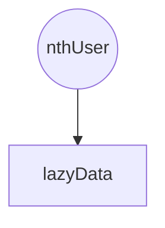

</div >

Reactivity libraries are at the heart of modern web component frameworks like Solid, Qwik, Vue, and Svelte.
And in some cases you can add fine-grained reactive state management to other libraries like Lit and React.
[Reactively](https://github.com/modderme123/reactively) comes with a
[decorator](https://github.com/modderme123/reactively/tree/main/packages/decorate) for adding reactive properties
to any class,
as well as prototype
integration with [Lit](https://github.com/lit/lit).
[Preact/signals](https://github.com/preactjs/signals) comes with a prototype integration
with [React](https://reactjs.org/).
Expect more integrations as these reactivity cores mature.

# Goals of a reactive library

The goal of a reactive library is to run reactive functions when their sources have changed.

We have a few properties that a reactive library should have:

- **Efficient**: Never overexecute reactive elements (if their sources haven't changed, don't rerun)
- **Glitch free**: Never allow user code to see intermediate state where only some reactive elements have updated (by the time you run a reactive element, every source should be updated)

# Lazy vs. Eager Evaluation

Reactive libraries can be divided into two categories: lazy and eager.

In an eager reactive library, reactive elements are evaluated as soon as one of their sources changes.

In a lazy reactive library, reactive elements are only evaluated when they are needed. (In practice, most lazy libraries also have an eager phase for performance reasons).

We can compare how a lazy vs eager library will evaluate a graph like this:

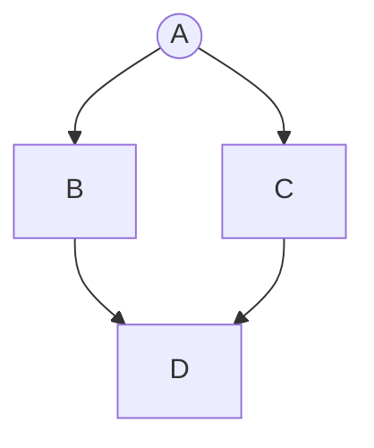

| Lazy                                                                                                                                                                              | Eager                                                                                                                            |
| --------------------------------------------------------------------------------------------------------------------------------------------------------------------------------- | -------------------------------------------------------------------------------------------------------------------------------- |
| A lazy library will recognize that the user is asking to update `D`, and will first ask `B` then `C` to update, then update `D` after the `B` and `C` updates have been completed | An eager library will see that `A` has changed, then tell `B` to update, then `C` to update and then `C` will tell `D` to update |

# Reactive Algorithms

The charts below consider how a change being made to `A` updates elements that depend on `A`.

Here are two core issues that each algorithm needs to carefully consider. The first is what we call the diamond problem, which can be an issue for eager reactive algorithms. They may accidentally evaluate `A,B,D,C` and then need to evaluate `D` a second time because `C` has updated:


The second challenge is the equality check problem, which can be an issue for lazy reactive algorithms. If some node `B` returns the same value as the last time we called it, then the node below it `C` doesn't need to update. (But a naive lazy algorithms might immediately try to update `C` instead of checking if `B` has updated first)

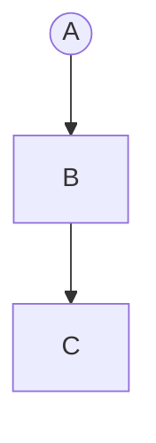

To make this more concrete, consider the following code: it is clear that `C` should only ever be run once because every time `A` changes, `B` will reevaluate and return the same value, so none of `C`'s sources have changed.

```ts
const A = reactive(3);
const B = reactive(() => A.value * 0); // always 0
const C = reactive(() => B.value + 1);
```

## MobX

In a blog post a few years ago, [Michael Westrate described](https://hackernoon.com/becoming-fully-reactive-an-in-depth-explanation-of-mobservable-55995262a254) the core algorithm behind MobX. MobX is an eager reactive library, so let's look at how the MobX algorithm solves the diamond problem.

After a change to node `A`, we need to update nodes `B`, `C` and `D` to reflect that change.
It's important that we update `D` only once, and only after `B` and `C` have updated.

MobX uses a two pass algorithm, with both passes proceeding from `A` down through its observers. MobX stores a count of the number of parents that need to be updated with each reactive element.

In the diamond example below, the first pass proceeds as follows:
After an update to `A`, MobX marks a count in `B` and `C` that they now have one parent that needs to update,
and MobX continues down from `B` and from `C` incrementing the count of `D` once for each parent that has a non 0 update count. So when the pass ends `D` has a count of 2 parents above it that need to be updated.

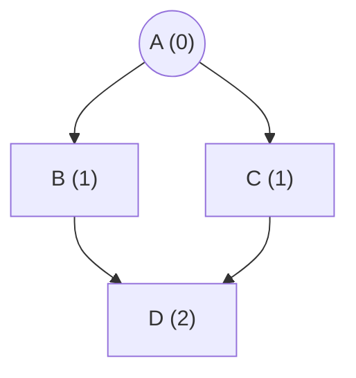

In a second pass, we update every node that has a zero count, and subtract one from each of its children, then tell them to reevaluate if they have a zero count and repeat.

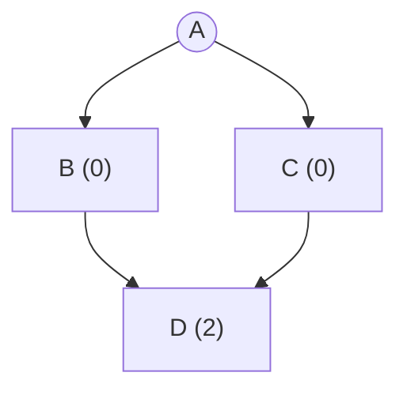

Then, `B` and `C` are updated, and `D` notices that both of its parents have updated.

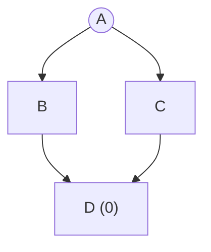

Now finally `D` is updated.


This quickly solves the diamond problem by separating the execution of the graph into two phases, one to increase a number of updates and another to update and decrease the number of updates left.

To solve the equality check problem MobX just stores an additional field that tells each node whether any of its parents have changed value when they updated

## Preact Signals

Preact's solution is described [on their blog](https://preactjs.com/blog/signal-boosting).
Preact started with the MobX algorithm, but they switched to a lazy algorithm.

Preact also has two phases, and the first phase "notifies" down from A (we will explain this in a minute), but the second phase recursively looks up the graph from `D`.

Preact checks whether the parents of any signal need to be updated before updating that signal. It does this by storing a version number on each node and on each edge of the reactive dependency graph.

On a graph like the following where A has just changed but B and C have not yet seen that update we could have something like this:

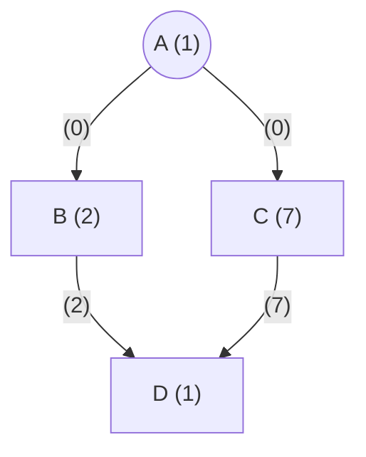

Then when we fetch D and the reactive elements update we might have a graph that looks like this

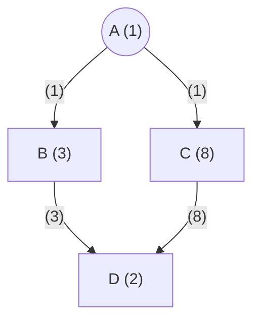

Additionally, Preact stores an extra field that stores whether any of its sources have possibly updated since it has last updated. Then, it avoids walking up the entire graph from `D` to check if any node has a different version when nothing has changed.

We can also see how Preact solves the equality check problem:

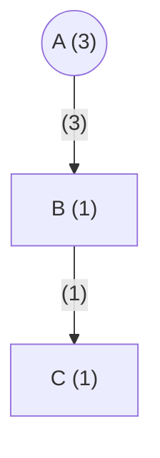

When `A` updates, `B` will rerun, but not change its version because it will still return 0, so `C` will not update.


# Reactively

Like Preact, Reactively uses one down phase and one up phase.
Instead of version numbers, Reactively uses only graph coloring.

When a node changes, we color it red (dirty) and all of its children green (check).
This is the first down phase.

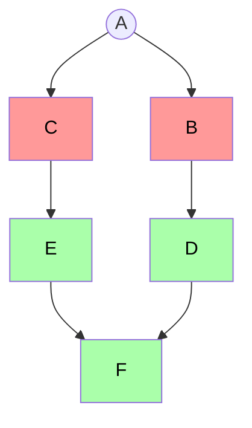

In the second phase (up) we ask for the value of `F`
and follow a procedure internally called `updateIfNecessary()` before returning the value of `F`.
If `F` is uncolored, it's value does not need to be recomputed and we're done.
If we ask for the value of `F` and it's node is red, we know that it must be re-executed.
If `F`'s node is green, we then walk up the graph to find the first red node that we depend on.
If we don't find a red node, then nothing has changed and the visited nodes are set uncolored.
If we find a red node, we update the red node, and mark its direct children red.

In this example, we walk up from `F` to `E` and discover that C is red.
So we update `C`, and mark `E` as red.

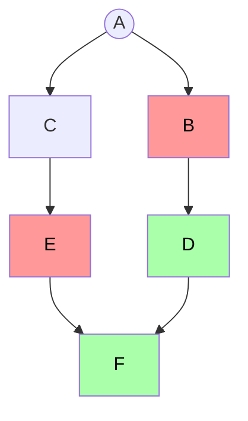

Then, we can update `E`, and mark its children red:

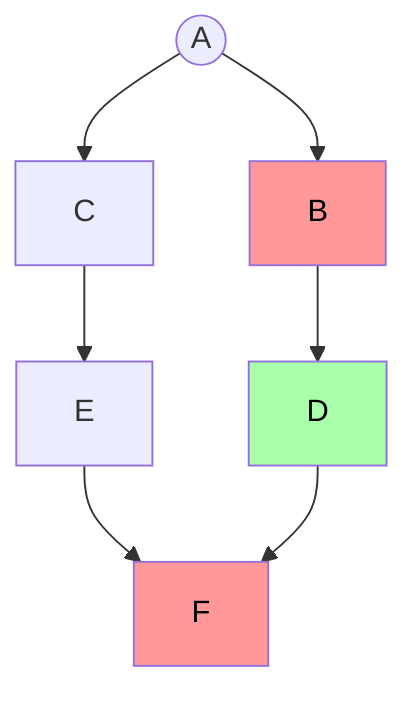

Now we know we must update `F`. `F` asks for the value of D and so we `updateIfNecessary` on `D`,
and repeat a similar traversal this time with `D` and `B`.

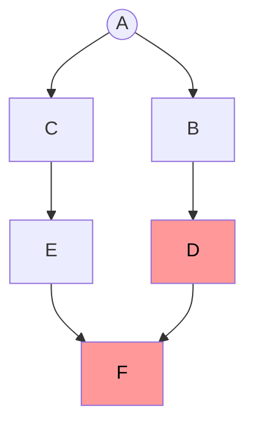

And finally we get back to a fully evaluated state:

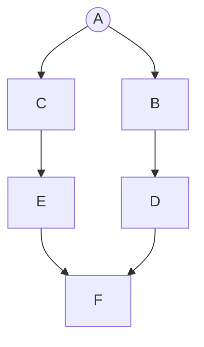

In code, the `updateIfNecessary` process looks like this:

```ts
/** update() if dirty, or a parent turns out to be dirty. */
updateIfNecessary() {
  // If we are potentially dirty, see if we have a parent who has actually changed value
  if (this.state === CacheCheck) {
    for (const source of this.sources) {
      source.updateIfNecessary(); // Will change this.state if source calls update()
      if (this.state === CacheDirty) {
        // Stop the loop here so we won't trigger updates on other parents unnecessarily
        // If our computation changes to no longer use some sources, we don't
        // want to update() a source we used last time, but now don't use.
        break;
      }
    }
  }

  // If we were already dirty or marked dirty by the step above, update.
  if (this.state === CacheDirty) {
    this.update();
  }

  // By now, we're clean
  this.state = CacheClean;
}
```

Ryan describes a related algorithm that powers Solid in his video announcing [Solid 1.5](https://youtu.be/jHDzGYHY2ew?t=5291).

# Benchmarks

Current reactivity benchmarks ([Solid](https://github.com/solidjs/solid/tree/main/packages/solid/bench), CellX, Maverick) are focused on creation time, and update time for a static graph. This doesn't tell us anything about how the chart performs for dynamic data.

We've created a new and more flexible benchmark that allows library authors to create a graph with a given number of layers of nodes and connections between each node, with a certain fraction of the graph dynamically changing sources, and record both execution time and GC time.

What we've discovered is that Reactively is generally the fastest (who would've guessed 😉), Solid has the most consistent performance, and Preact is surprisingly fast for deep graphs (although this also caught a performance cliff in the preact implementation that will hopefully be fixed soon).

- Show chart
- tool allows benchmarking various dependency graph configurations
  - vary size, interconnection density, number of dynamic nodes, number of nodes read
  - measure how many nodes are re-executed, time and gc time
- For performance sensitive users of these frameworks:
  - all the frameworks are fast enough for moderate sized graphs (modulo some bugs)
    - 100s of re-executing elements, framework adds < 1ms
  - for more demanding uses, reactively is usually the fastest, solid is the most stable (but may over-execute),
    and preact/signal has a slight edge for very deep graphs.
    - expect this to change as the frameworks improve.
- For developers of these frameworks
  - useful tool for further study
  - Ample opportunity to cross-pollinate. In particular some techniques from reactively may be applicable to solid since it uses a similar algorithm.
- some issues:
  - solid executes some nodes unnecessarily
  - preact hangs in certain configurations of dynamic graphs (discussing)
- reactively does very well on performance across the board
- all of the frameworks stack overflow on exceptionally deep graphs.
  - solid is the best.
  - room for improvement for all the frameworks on this.
